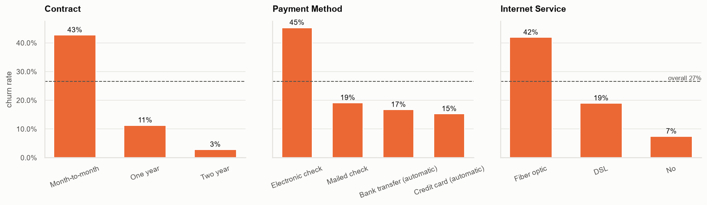
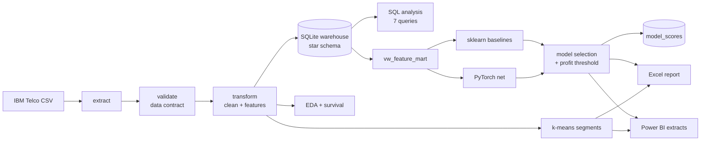
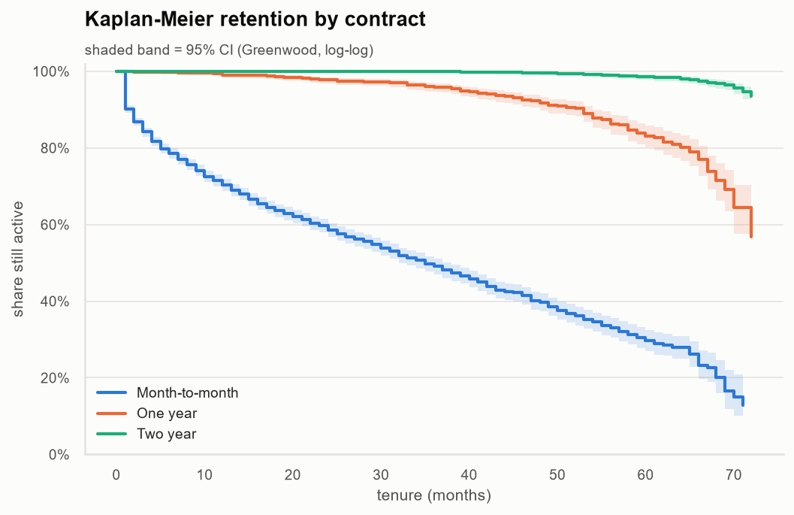
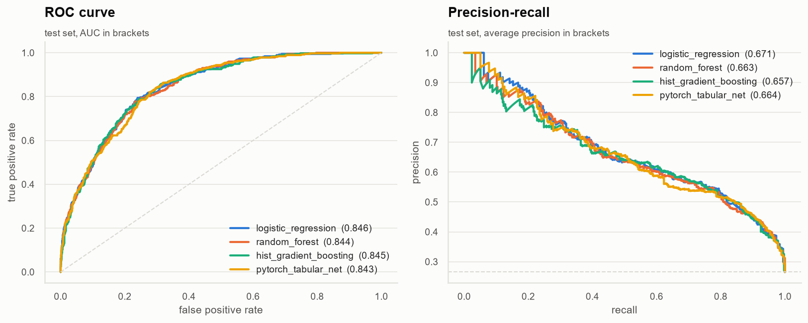
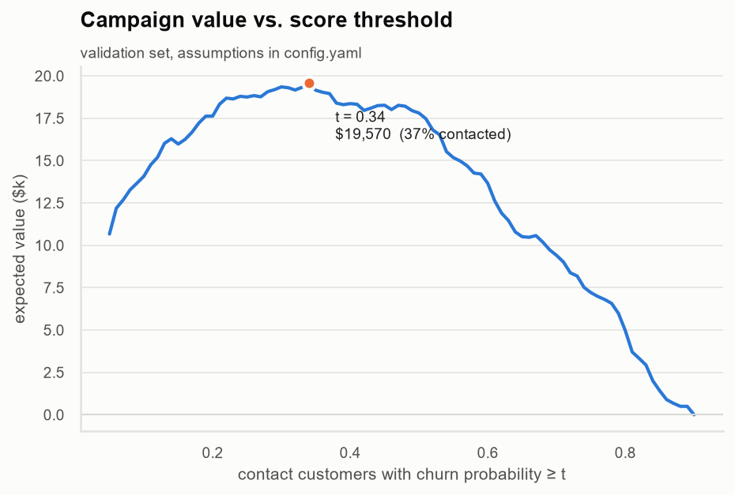
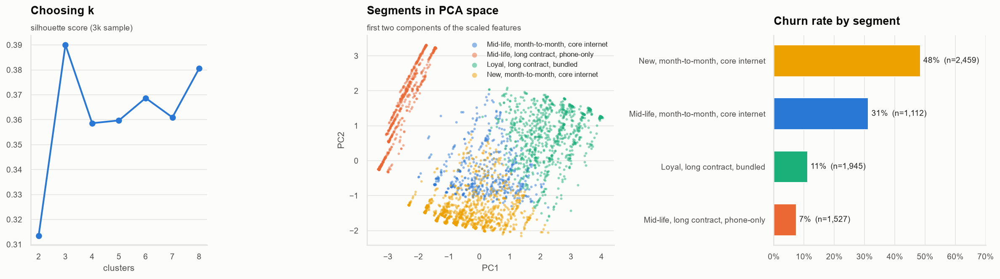

# Telco Customer Churn — end-to-end analytics

Why do telecom customers leave, who is about to leave next, and how much is it worth to try to keep them?

This project takes the public IBM Telco churn dataset through a full analytics workflow: an ETL pipeline
into a SQL warehouse, exploratory and survival analysis in Python, classical ML models vs. a PyTorch
neural net, a retention-campaign ROI model, and the results packaged for business users in Excel and Power BI.



## Stack

| Layer | Tools |
|---|---|
| Pipeline | Python, pandas, custom DAG runner, data validation contract |
| Storage | SQLite star schema, SQL views, window functions |
| Analysis | NumPy, pandas, SciPy, Matplotlib, Seaborn, Kaplan-Meier (NumPy implementation) |
| ML | scikit-learn (logistic regression, random forest, gradient boosting, k-means), PyTorch (entity-embedding MLP) |
| Reporting | Excel (openpyxl, live formulas), Power BI (Power Query M, DAX) |
| Quality | pytest, GitHub Actions |

## Architecture



`run_pipeline.py` resolves step dependencies, so `--steps train` also runs everything `train` needs.
Every run writes `reports/run_manifest.json` with step timings, validation results and the chosen model.

## Project layout

```
├── config/config.yaml          # paths, model hyper-parameters, campaign economics
├── run_pipeline.py             # CLI entry point
├── src/churn/
│   ├── pipeline/               # extract, validate, transform, load, runner
│   ├── analysis/               # EDA figures, Kaplan-Meier + log-rank, SQL runner, plot style
│   ├── models/                 # features, sklearn baselines, PyTorch net, evaluation, segmentation
│   └── reporting/              # Excel workbook builder, Power BI extracts
├── sql/
│   ├── schema.sql, views.sql   # warehouse DDL
│   └── analysis/               # business questions answered in SQL
├── notebooks/                  # EDA and modelling walkthroughs
├── powerbi/                    # Power Query (M), DAX measures, report theme
├── excel/                      # generated Excel report
├── reports/                    # figures, metrics, SQL outputs
├── docs/                       # data dictionary, Power BI model notes
└── tests/
```

## Running it

```bash
python -m venv .venv && source .venv/bin/activate
pip install -r requirements.txt
python run_pipeline.py            # full run, ~1-2 min on a laptop
pytest -q
```

The raw file is downloaded on the first run and cached in `data/raw/`.
Individual steps: `python run_pipeline.py --steps sql` or `make models`, `make reports`, etc.

## What the data says

The base is 7,043 customers with a 26.5% churn rate.

- **Contract is the single biggest driver.** Month-to-month customers churn at ~43%, one-year at ~11%,
  two-year at ~3%. The Kaplan-Meier curves split almost immediately (`07_km_retention.png`) and the log-rank
  test is decisive.
- **The first year is the danger zone.** Close to half of customers in their first 12 months leave;
  after two years the hazard drops sharply.
- **Fiber optic customers churn more than twice as often as DSL** (~42% vs ~19%) even though it's the
  premium product — a sign of a price/value problem rather than a pure technology one.
- **Electronic check is a red flag** (~45% churn) — much higher than any automatic payment method.
- **Protection add-ons matter, streaming doesn't.** Online security and tech support go with a large drop
  in churn; streaming TV/movies make little difference.



### SQL layer

The warehouse is a small star schema (`dim_customer`, `dim_contract`, `dim_payment`, `dim_internet`,
`fact_subscription`, a bridge table for add-ons, and `model_scores`). The queries in `sql/analysis/`
use CTEs, conditional aggregation, `NTILE`, `RANK`, `PERCENT_RANK` and running totals to answer things like
*which contract × payment combinations account for 80% of lost revenue* (`02_revenue_at_risk.sql`).
The modelling input itself is a SQL view (`vw_feature_mart`) that pivots the add-on bridge back to wide
format and adds window-function features such as price relative to peers.

## Modelling

- Stratified train / validation / test split (65 / 15 / 20).
- **Baselines:** L2 logistic regression, random forest, histogram gradient boosting — each in an sklearn
  `Pipeline` with one-hot encoding and scaling, 5-fold CV on the training set.
- **PyTorch:** an MLP with learned embeddings for every categorical (dimension `min(8, (k+1)/2)`),
  batch-normalised numerics, SiLU + dropout blocks, AdamW, LR-on-plateau and early stopping on validation AUC.
- The winner is picked on **validation** AUC; all reported numbers are on the untouched **test** split.
- Model-agnostic permutation importance so the neural net and the tree models are explained the same way.

  
### Results

Test set (1,409 customers, never seen during training or model selection):

| Model | CV AUC (5-fold) | Valid AUC | Test ROC-AUC | Test PR-AUC | Brier | Top-decile lift |
|---|---|---|---|---|---|---|
| Logistic regression | 0.855 ± 0.007 | 0.819 | **0.846** | **0.672** | **0.136** | **2.88×** |
| Hist gradient boosting | 0.845 ± 0.009 | 0.818 | 0.845 | 0.657 | 0.137 | 2.83× |
| Random forest | 0.849 ± 0.009 | 0.816 | 0.844 | 0.663 | 0.136 | **2.88×** |
| PyTorch tabular net | – | **0.825** | 0.843 | 0.664 | 0.138 | 2.80× |

- All four models land within 0.004 AUC of each other on the test set. The signal in this dataset is mostly
  contract, tenure, internet type and payment method, which a regularised logistic regression captures well.
- The PyTorch net won on validation and was selected by the pipeline, but it doesn't beat logistic regression
  on held-out data. In production I'd ship the logistic regression: same accuracy, easier to explain,
  better calibrated.
- Top-decile lift of 2.9× means the 10% of customers the model ranks riskiest churn at roughly 76%,
  against a 26.5% base rate.

**Campaign value (test set):** contacting customers above the value-maximising threshold of 0.34 returns
an expected **+$25.7k**, while contacting everyone would **lose $3.7k** under the same offer assumptions.
Full comparison: [`reports/model_comparison.md`](reports/model_comparison.md) · run summary: [`reports/metrics.json`](reports/metrics.json)



### From probabilities to a decision

A 0.5 cut-off isn't a business decision. `config.yaml` holds the campaign assumptions (offer cost,
acceptance rate, months of revenue retained) and the pipeline picks the threshold that maximises expected
value on the validation set, then reports what that campaign would have returned on the test set compared
with contacting everyone.



### Segmentation

k-means on tenure, spend, services, contract length and payment behaviour (k chosen with silhouette),
built without the churn label. The label is only used afterwards to profile the segments.



## Excel report

`excel/telco_churn_report.xlsx` is generated by the pipeline but every number in it is a live formula
(`COUNTIFS`, `SUMIFS`, `AVERAGEIFS`, `SUMPRODUCT`) over the `Data` sheet:

- **Summary** — KPIs and churn breakdowns by contract, internet, payment, tenure band with charts
- **Risk & Campaign** — risk tiers vs. actual churn, and a campaign simulator driven by the Assumptions tab
- **Segments** — k-means segment profiles
- **Assumptions** — editable inputs (offer cost, acceptance rate, threshold)

## Power BI

The `powerbi` step exports a star schema to `data/powerbi/`. The report is built on:

- `powerbi/queries.pq` — Power Query with a `DataFolder` parameter and a shared CSV loader function
- `powerbi/measures.dax` — 36 measures: churn/retention, MRR lost, ARPU, expected MRR at risk,
  campaign precision/recall, and what-if parameters for a live campaign ROI simulator
- `powerbi/theme.json` — colour theme matching the Python charts

Model relationships and page layout are in [`docs/powerbi_model.md`](docs/powerbi_model.md).

## Limitations

- It's a single snapshot, so "tenure" doubles as survival time and there's no usage or support-ticket history.
- The campaign economics are assumptions, not measured values — the threshold should be re-tuned once a
  real retention pilot has run.
- Scores in `fact_churn_score` cover all customers; only rows with `split = "test"` are out-of-sample.

## Data

IBM Telco Customer Churn sample dataset (IBM Cognos Analytics samples). See [`docs/data_dictionary.md`](docs/data_dictionary.md).
